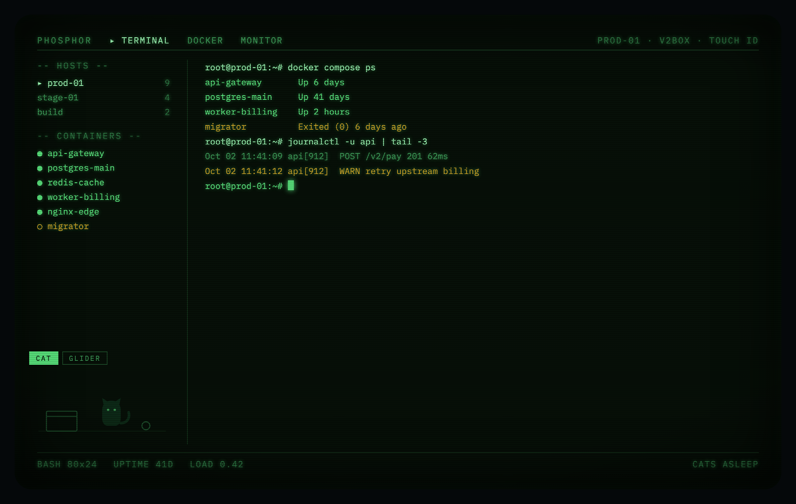
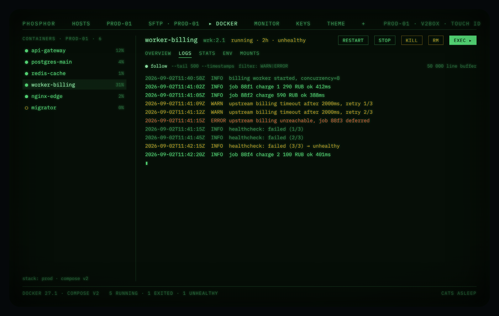
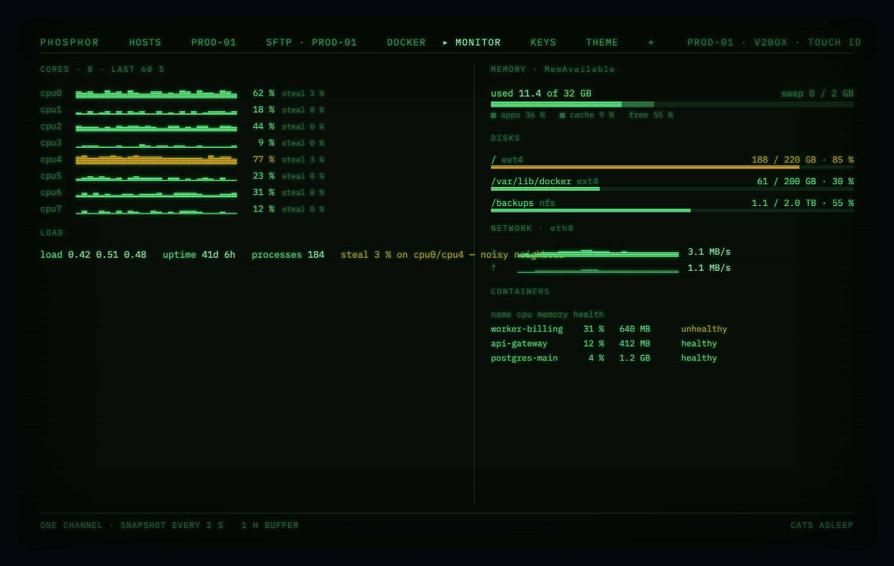
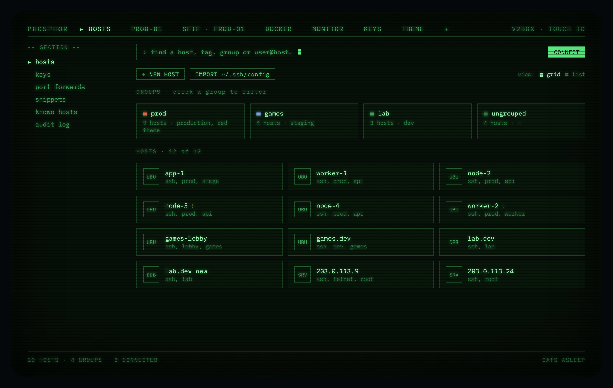
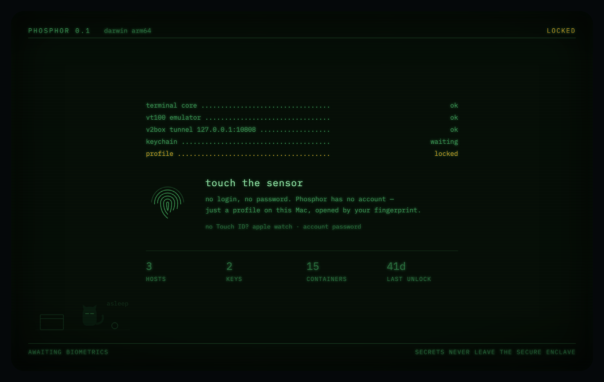
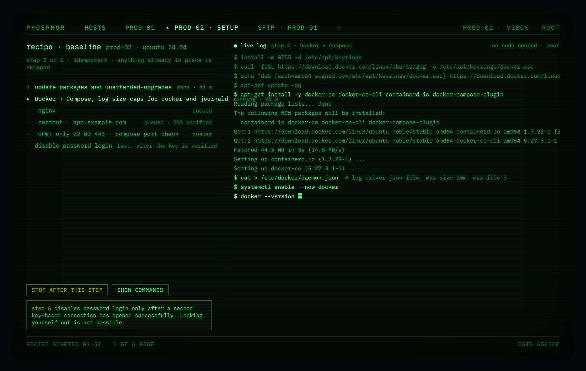
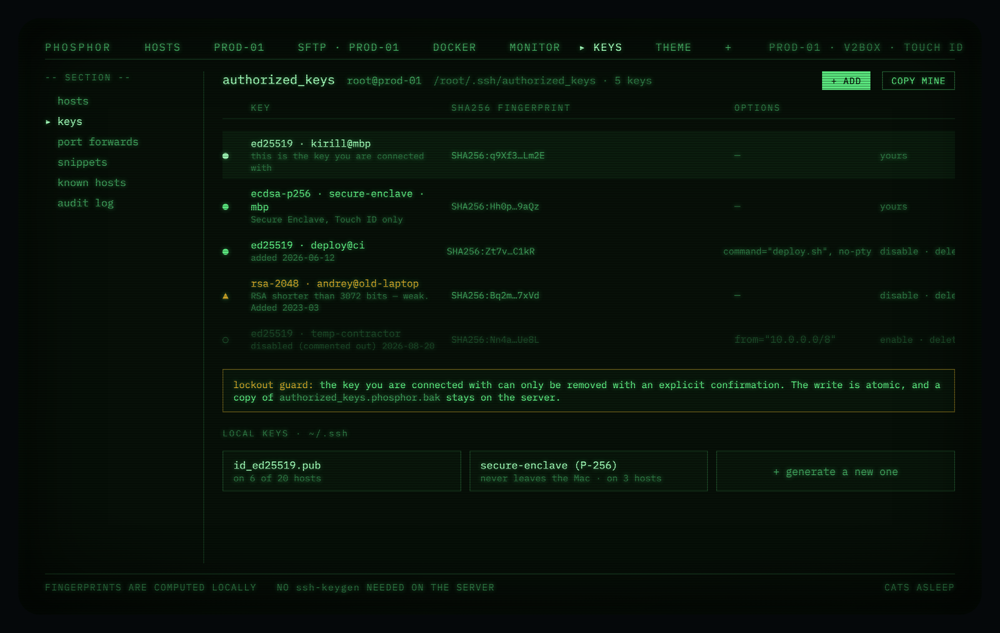
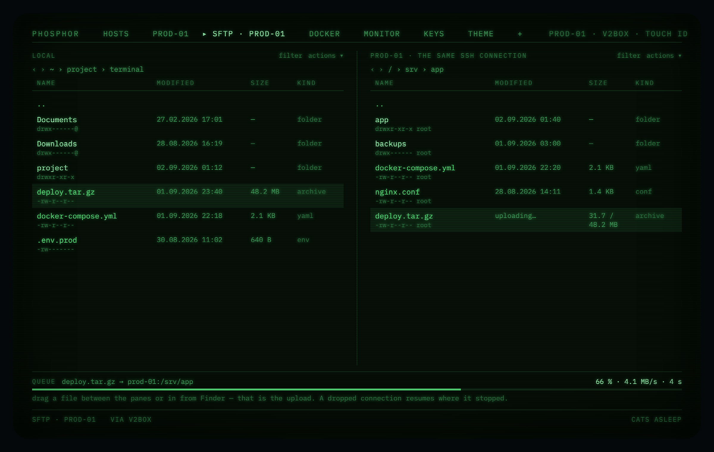
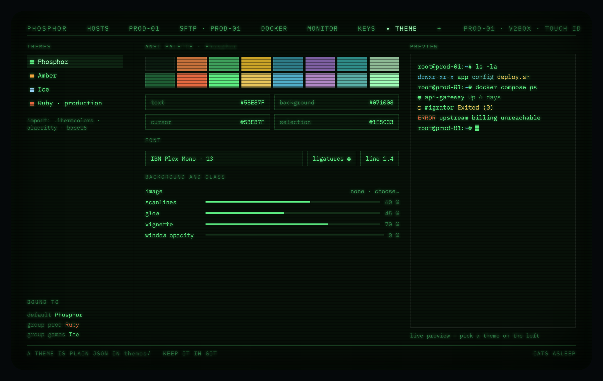

<div align="center">

# Phosphor

**A macOS terminal that also runs your servers.**

Shell, Docker, metrics, keys and files — over one SSH connection per host.
Unlocked with your fingerprint. Green on black, because that is how it should look.

</div>



---

## The problem

You keep four windows open to do one job. A terminal for the shell. A second
terminal for `docker logs -f`. A third for `htop`. A browser tab for whatever
dashboard someone installed on the box. Each of them logs in separately, each
one asks for the key passphrase again, and none of them knows what the others
are looking at.

Phosphor opens **one SSH connection per host** and multiplexes everything
through it — the interactive shell, container logs, `docker` commands, `/proc`
snapshots, SFTP transfers, port forwards. One login. One tunnel through your
proxy. One place where the state lives.

And because that state is already in the app, it also exposes an **MCP server**:
Claude Code and Claude Desktop can use your servers through your connections,
your keys and your access policy — with every call written to an audit log.

---

## What it does

### Docker, without leaving the terminal



The container list is a sidebar, not a separate app. Inspect, stats, mounts,
environment and live logs with `--tail` and a filter, streamed over the SSH
connection you already have. Environment values whose name looks like a secret
(`PASS`, `KEY`, `TOKEN`, `SECRET`) are masked in the UI and never copied into
the audit log.

No Docker Engine API to expose, no socket to tunnel: it shells out to `docker`
with JSON output, which works on every box where Docker already runs.

### Metrics that cost one channel



Per-core load, memory with the cache broken out, disks, network, and per
container CPU and memory — from `/proc` snapshots taken over a single
long-lived channel. No agent to install on the server, no swarm of exec
channels. Polling stops when the window is hidden, and every buffer has a
ceiling.

### Hosts, groups and tags



One group per host, as many tags as you like. The group carries the settings —
how to reach it, which key, which theme, what MCP is allowed to do — and tags
are just for finding things. Import `~/.ssh/config` and keep going.

### Unlock with a fingerprint



Phosphor has no account and no password of its own. There is a profile on this
Mac, and your fingerprint opens it. Passwords, passphrases and TOTP seeds live
in the Keychain behind biometrics; keys can live in the Secure Enclave, where
they cannot be copied off the machine at all. Risky actions ask again.

### A new server, set up by a recipe



Connect to a fresh box and Phosphor probes it: what is installed, what is
listening, whether anyone has been here before. If it is empty, it offers a
recipe — packages and unattended upgrades, Docker with log size caps, nginx,
certbot, a firewall that only opens 22/80/443, and finally disabling password
login. Every step is idempotent, every step shows the exact commands, and the
lockout guard means password login is closed only after a second key-based
connection has proved it works.

### Keys you can actually see



`authorized_keys` as a table instead of a text file: fingerprints computed
locally, weak RSA flagged, options shown, disabled entries kept as comments.
The key you are currently connected with cannot be removed without an explicit
confirmation, writes are atomic, and a backup stays on the server.

### Files on both sides



Two panes, drag between them or in from Finder. Same SSH connection, same
proxy. A dropped transfer resumes where it stopped.

### Make it yours



Themes are plain JSON in `themes/` — keep them in git, trade them with people,
import `.itermcolors`, alacritty and base16. Palette, font, ligatures, line
height, background image, scanlines, glow, vignette, window opacity. Bind a
theme to a group so production is unmistakably red.

And there is a cat in the corner. Or a sugar glider. It sleeps while the app is
locked, it never covers your output, and one switch turns it off forever.

---

## Principles

**No integrations.** The only network traffic the app makes is SSH to your own
servers and the update feed. No telemetry, no accounts, no third-party
services, nothing phoning home.

**Secrets stay secret.** Never in a log line, a crash report, an MCP audit
entry or an error message. Terminal scrollback is not written to disk by
default.

**Errors tell you what to do.** "Could not connect" is a bug. "The proxy at
127.0.0.1:10808 is not answering — is V2Box running?" is an error message. The
app distinguishes a dead proxy from an unreachable server from a refused
credential, because otherwise diagnosis is guesswork.

**It stays fast because it is open all day.** Bytes from the network are
batched into ~16 ms windows before they reach the emulator, the draw path
allocates nothing, every buffer is bounded, polling stops when the window is
not visible, and animations only ever touch `transform` and `opacity`.

**Strict Swift 6 concurrency**, in every target, with no escape hatches.
Network, parsing and disk work live in actors; only view models are on the main
actor.

**Two languages.** English and Russian, both through a String Catalog. Not one
hardcoded interface string — a linter checks.

---

## Status

Builds, runs, **138 tests green**. Nine screens: lock, hosts, terminal, files,
Docker, monitor, keys, provisioning, AI activity. Interface in Russian and
English.

What works against a real server: SSH over one multiplexed connection per host,
container listing with actions and streaming logs, `/proc` metrics, reading and
editing `authorized_keys`, provisioning recipes, both file panes, and an
interactive shell that rides the same socket.

What is not built yet: the MCP stdio shim (the policy engine and audit trail
are), the native Citadel transport, and the new-host form.

Idle CPU is zero — no timers, polling pauses when the window is in the
background.

## Install

Download `Phosphor.app.zip` from the release page, unzip it, move it to
Applications.

**macOS will warn you the first time.** The app is ad-hoc signed — there is no
Apple Developer certificate behind it — so everything downloaded from the
internet lands in quarantine. This is not damage:

1. Double-click the app, dismiss the warning.
2. System Settings → Privacy & Security → scroll down → **Open Anyway**.
3. Confirm. It never asks again.

One command instead, if you prefer:

```
xattr -dr com.apple.quarantine /Applications/Phosphor.app
```

Updates arrive through Sparkle and are installed by the app itself, so they are
never quarantined: the warning happens exactly once, on first install.

## Build

Requires macOS 26+ and a Swift 6.3 toolchain.

```sh
git clone https://github.com/Kirusshenkin/terminalOs.git
cd terminalOs
swift build
swift test
./scripts/check.sh     # format, lint, build, tests — before every commit
```

## Layout

```
Sources/          PhosphorCore, VaultKit, HostsKit, SSHKit, DockerKit,
                  MetricsKit, KeysKit, ThemeKit, ProvisionKit, PhosphorUI
design/           UI artboards (.dc.html), one per screen
docs/PLAN.md      The full architecture plan, in Russian
docs/images/      Screenshots rendered from the artboards
CLAUDE.md         Conventions: language, concurrency, errors, secrets, perf
```

## Contributing

The plan comes first — requirements land in [`docs/PLAN.md`](docs/PLAN.md)
before any code. The conventions in [`CLAUDE.md`](CLAUDE.md) apply to everyone,
not just to the machines.

## Security

Please report vulnerabilities privately — see [`SECURITY.md`](SECURITY.md).
The threat model is `docs/PLAN.md` §15.

## License

[MIT](LICENSE)
